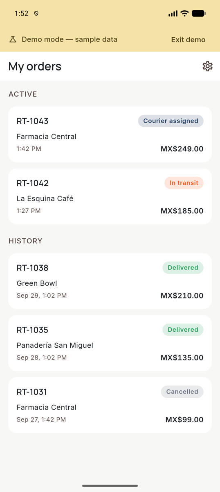
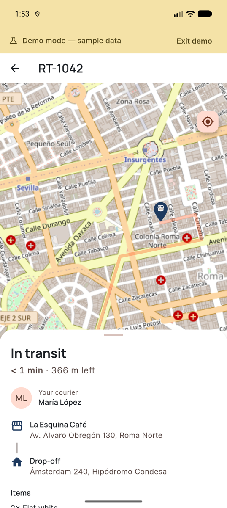
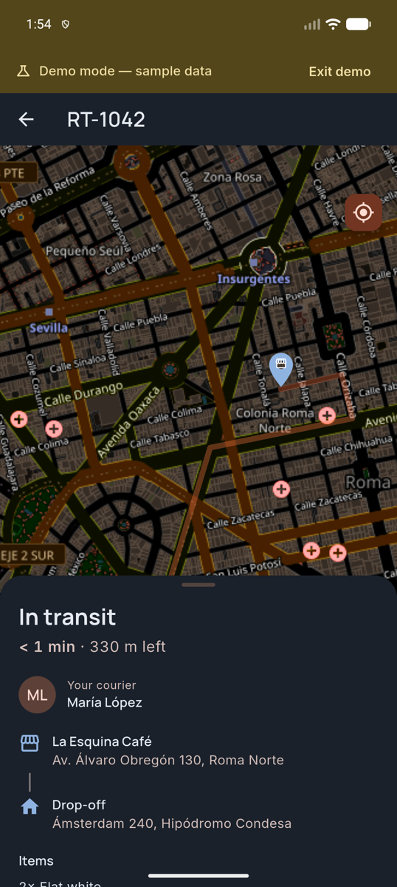
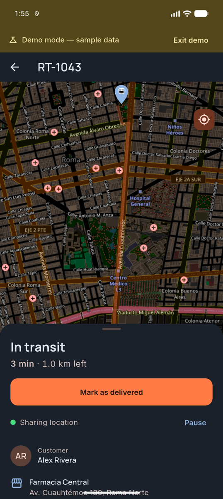
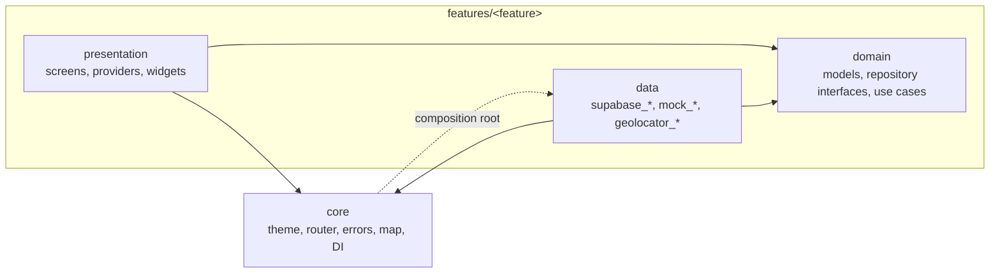
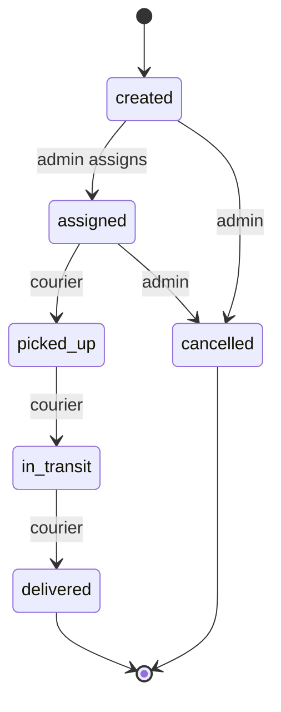

# Rutta

*Know exactly where your order is.*

[](https://github.com/malpi-dev/Rutta/actions/workflows/ci.yaml)
[](https://github.com/malpi-dev/Rutta/releases/latest)


Rutta is a delivery tracking app with two roles. The **customer** follows the courier live on a map; the **courier**
works through assigned orders, advances their status and shares their location while delivering.

<!-- TODO(author): add docs/media/demo.gif (split-screen customer/courier, 15-30 s) right here. -->

| Customer list | Live tracking (light) | Live tracking (dark) | Courier |
|---|---|---|---|
|  |  |  |  |

## Try it

Download the APK from the [latest release](https://github.com/malpi-dev/Rutta/releases/latest) and install it on an
Android device.

Tap **Explore demo** and pick *customer* or *courier*: no account and no internet needed.

## Features

- Live tracking: the courier marker moves smoothly along the route, with ETA, distance and a status timeline.
- Two roles: customer (orders list and tracking) and courier (assigned orders, status actions, location sharing).
- Order state machine enforced in the database (`created → assigned → picked_up → in_transit → delivered`).
- Location permission flow (denied, denied forever, services off), throttled location updates and wakelock while sharing.
- Dark mode everywhere, including the map.
- Demo mode with a simulated courier; works offline and with the backend paused.
- Email + 6-digit code sign-in (no passwords, no deep links).

## Tech stack

Flutter, Riverpod (with `riverpod_generator`), go_router, freezed, Supabase (Postgres, Auth OTP, Realtime),
flutter_map + OpenStreetMap, geolocator, wakelock_plus, Maestro, GitHub Actions.

## Architecture

Clean Architecture, organized by feature, in a light version: `presentation → domain ← data`, plus `core`.



Dependencies point towards `domain`, which imports nothing from Flutter, Supabase or the map packages
(`tool/check_architecture.sh` enforces it). The UI never talks to Supabase: it asks a repository, and the
composition root (`lib/core/di/repository_providers.dart`) decides which implementation to provide.

Repositories are interchangeable: every backend repository has a `supabase_*` and a `mock_*` implementation
(`geolocator_*` + `mock_*` for the device location). *Explore demo* switches the app to the mock ones, backed by an
in-memory store with a simulated courier, so reviewers can try everything without an account. Repositories throw typed
`DomainError`s, never raw SDK exceptions.

Order status machine (the same table lives in Dart, for the buttons, and in SQL, as the source of truth):



### Swapping the map provider

`flutter_map` and `latlong2` are imported only inside `lib/core/map/`; screens use `RuttaMap` and `GeoPoint`. To move
to Google Maps:

1. Add `google_maps_flutter` and put your API key in the Android manifest.
2. Implement `GoogleRuttaMap` in `lib/core/map/google/` with the `RuttaMapDelegate` interface.
3. Return it from `ruttaMapBuilderProvider`.

Screens don't change.

## Backend

Supabase, no custom server. Everything lives in the `rutta` schema of a shared project.

| Table | Purpose |
|---|---|
| `profiles` | One row per user: name, phone, `role` (`customer` / `courier`). |
| `orders` | Pickup and drop-off places, items, total (MXN cents), status, route (`jsonb`, `[lng, lat]`), customer and courier. |
| `order_status_events` | Status history, written by a trigger. |
| `courier_locations` | Last known position of each courier (one row per courier, deleted when the delivery ends). |

**RLS** is enabled on all four tables (10 policies, each commented in the migration):

| Policy | Protects |
|---|---|
| `profiles_select_own` | A user reads only their own profile. |
| `profiles_select_counterpart` | Customer and courier of the same order read each other's name and phone. |
| `profiles_update_own` | A user updates their own profile; a column-level grant stops them changing `role`. |
| `orders_select_customer` | A customer reads only their own orders. |
| `orders_select_courier` | A courier reads only the orders assigned to them. |
| `events_select_participants` | Only the order's customer and courier read its history. |
| `locations_select_own` | A courier reads their own position. |
| `locations_select_customer_active` | A customer sees the courier location only for their own order, only while `picked_up` / `in_transit`. |
| `locations_insert_courier`, `locations_update_courier` | A courier writes only their own position, only for their own order in progress. |

**Triggers:** status guard (valid transitions only), status history, location cleanup when an order ends, server-side
`recorded_at`. **RPCs:** `ensure_profile` (called by the app after verifying the code; there is no trigger on the shared
`auth.users`), `advance_order_status` (the courier's 3 transitions) and `admin_assign_order` (SQL/secret key only).

**Realtime:** `postgres_changes` on orders, events and locations, filtered by RLS; channels are named `rutta:<topic>:<id>`.

**No Edge Functions:** nothing needs a secret key.

## Map and routing policies

- Tiles come from the standard OpenStreetMap tile server, following its
  [tile usage policy](https://operations.osmfoundation.org/policies/tiles/): a real `User-Agent`
  (`MAP_USER_AGENT_PACKAGE`), visible attribution, no bulk pre-fetching. `MAP_TILE_URL` is configurable, so a commercial
  provider can be used if traffic grows.
- Routes are computed once with the OSRM public demo server (`tool/fetch_routes.dart`) and stored as fixtures and in the
  seed; the app never calls OSRM at runtime.
- Map data © OpenStreetMap contributors (ODbL).

## Getting started

Requirements: Flutter 3.44 (stable), Android SDK; Docker and the Supabase CLI for the backend.

```bash
flutter pub get
dart run build_runner build -d
```

**Without Supabase** (demo mode only):

```bash
flutter run
```

**With local Supabase:**

```bash
supabase start && supabase db reset
cp .env.example.json .env.json        # fill SUPABASE_PUBLISHABLE_KEY from `supabase status`
flutter run --dart-define-from-file=.env.json
```

Login codes arrive in Mailpit at http://127.0.0.1:54324. Seed users: `customer@rutta.test`, `courier1@rutta.test`.
Move a courier along a route with `./tool/simulate_courier.sh RT-1042`.

**Remote project:** apply the migration with `psql "$SUPABASE_DB_URL" -f supabase/migrations/20261005000000_rutta_init.sql`
(never `supabase db push`: the migration history is shared between apps), expose the `rutta` schema in *Data API
settings*, create sample orders with `supabase/scripts/create_sample_orders.sql` and get a login code for a test account
without sending email using `./tool/get_otp.sh <email>` (needs the secret key in your shell).

## Testing

```bash
./tool/check.sh                                  # format, architecture check, analyze, unit and widget tests
supabase test db                                 # pgTAP: RLS and business rules
RUTTA_IT=1 RUTTA_PUBLISHABLE_KEY=<key> flutter test -j 1 --tags supabase test/integration/   # against local Supabase
./tool/e2e.sh                                    # Maestro flows on a connected device/emulator
```

## Privacy

Only the courier's last position is stored, only while a delivery is in progress and only while the app is open. It is
deleted when the order ends.

## Roadmap

- Dispatch panel (`dispatcher` role): create orders, assign couriers, fleet map.
- Background location with a foreground service.
- Runtime routing with a configurable provider and re-routing.
- ETA based on traffic or the courier's real speed.
- Push notifications on status changes.
- Proof of delivery with a photo.
- Customer-courier chat.
- Google Maps as a second map implementation.
- Route replay and courier metrics.
